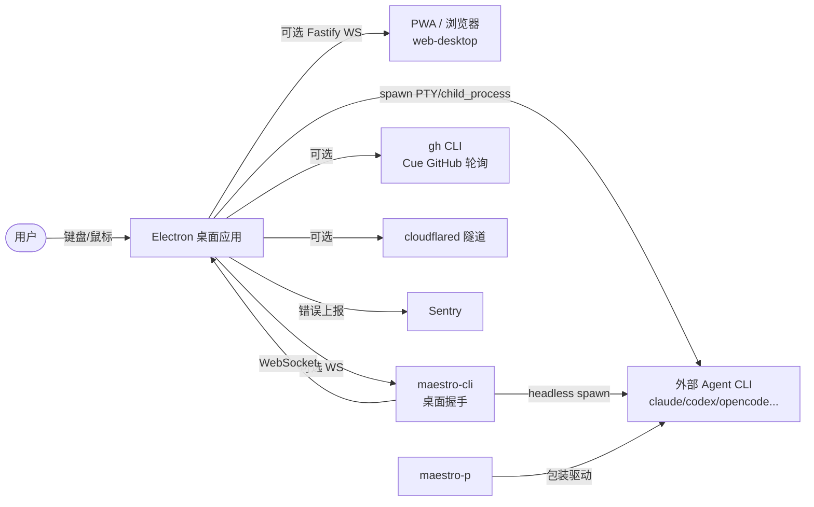
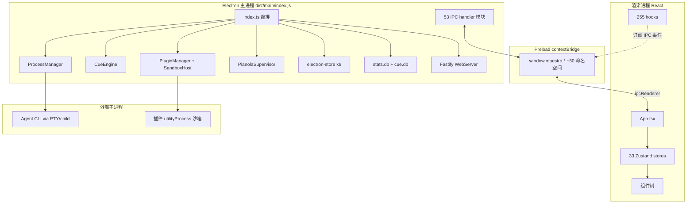
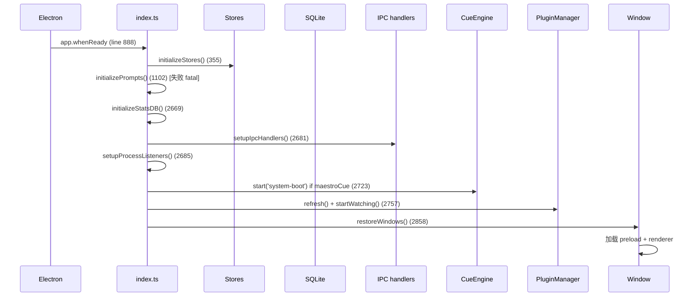

# SOURCE_ARCHITECTURE.md - 源码架构(核心文档)

## 分析快照

- 分支:`docs/multi-agent-review-loop-analysis`
- HEAD:`9affd8cfb27c8cfe39817ae92879445dc0632b40`
- 工作区状态:任务前 clean;本文档为本次任务新增
- 子模块状态:无
- 分析范围:`src/main`、`src/renderer`、`src/shared`、`src/cli`、`src/maestro-p`、`src/web-desktop`、`src/web`、`src/prompts`、构建脚本
- 未覆盖范围:`src/__tests__` 仅抽样;依赖缓存与构建产物按规约忽略

## 证据分类

- Evidence:源码/配置直接证明
- Inference:多证据推导
- Unknown:需运行时确认

## 核心结论

[Evidence] Maestro 是单体 Electron 应用,代码按进程职责分为 5 个一级源码区:`src/main`(主进程,474 文件)、`src/renderer`(渲染进程,1544 文件)、`src/shared`(跨进程纯逻辑/类型,130 文件)、`src/cli`(独立 CLI,91 文件)、`src/maestro-p`(Claude TUI 包装器,10 文件);外加 `src/web-desktop`(浏览器桥,4)、`src/web`(PWA 资产 + 遗留,49)、`src/prompts`(系统提示词,93)。
证据:`git ls-files src` 按 `awk -F/ '{print $2}'` 统计(见 evidence/inventory-by-area.txt)。

---

## 1. 仓库总体结构

```
src/
├── main/            Electron 主进程(Node.js):编排、IPC、进程管理、存储、Cue/插件/Pianola
│   ├── index.ts        ~3500 行编排入口(DI + whenReady 链)
│   ├── preload/        contextBridge 桥(每命名空间一文件,多入口打包)
│   ├── ipc/handlers/   53 个 IPC handler 模块(ipcMain.handle ~511 处)
│   ├── process-manager/ ProcessManager + PtySpawner/ChildProcessSpawner/OpencodeServerSpawner
│   ├── process-listeners/ 8 个输出/退出/错误监听器
│   ├── stores/         electron-store 实例 + 迁移
│   ├── stats/          SQLite(stats.db)+ CRUD
│   ├── cue/            事件驱动自动化引擎(12+ 组合服务)
│   ├── group-chat/     多 agent 主持人/参与者协作
│   ├── plugins/        插件沙箱/签名/授权账本/broker
│   ├── agents/         agent 定义/能力/检测
│   ├── parsers/        8 个 agent 输出解析器 + 错误模式
│   ├── storage/        每 agent 会话存储(BaseSessionStorage)
│   ├── web-server/     Fastify Web/WS 服务(web-desktop + CLI 远程)
│   ├── app-lifecycle/  退出处理/窗口管理
│   └── utils/          ssh-spawn-wrapper、sentry、shell-escape 等
├── renderer/        React 渲染进程(Zustand 状态,33 store;255 hook;135+ 组件)
│   ├── App.tsx         ~3600 行编排组件
│   ├── main.tsx        ReactDOM 根
│   ├── stores/         33 个 Zustand store
│   ├── hooks/          session/agent/batch/keyboard/ui/remote/...
│   ├── components/     AppShell、MainPanel、SessionList、Settings、Markdown、Wizard、Cue、GroupChat、XTerminal
│   ├── services/       IPC 服务封装(git/process/cue...)
│   ├── contexts/       LayerStack/GitStatus/Window/Input/InlineWizard
│   └── global.d.ts     window.maestro.* 类型契约(~3960 行)
├── shared/          跨进程纯逻辑/类型(themes、formatters、cue/pianola/agent-run 契约、plugins SDK 契约)
├── cli/             maestro-cli(Commander,100+ 动词)+ agent-spawner/batch-processor/goal-runner
├── maestro-p/       独立 TUI 包装器(保留 Claude Max 配额)
├── web-desktop/     浏览器构建的 WebSocket IPC 桥(4 文件)
├── web/             PWA 资产(public/)+ 遗留移动 PWA 代码
├── prompts/         93 个 .md 系统提示词(可定制)
└── __tests__/       1404 测试文件(见 测试与CI.md)
```

非 `src/` 关键目录:`packages/plugin-sdk`(独立发布的 `@maestro/plugin-sdk`)、`scripts/`(构建/代码生成)、`build/`(electron-builder 资源)、`e2e/`(Playwright)、`.github/workflows/`(CI)、`.husky/`(git hooks)、`docs/`(Mintlify 文档)。

## 2. 应用入口与分层

### 2.1 进程模型(系统上下文)


(Evidence:`src/main/index.ts`、`src/main/web-server/WebServer.ts`、`src/cli/services/maestro-client.ts`、`src/maestro-p/index.ts`、`src/main/tunnel-manager.ts`)

### 2.2 进程/容器图


(Evidence:`src/main/index.ts:488-503` 单例、`:1209-1475` Cue 构造、`:2201-2435` 插件、`src/main/preload/index.ts:84-267`、`src/main/plugins/plugin-sandbox-host.ts`)

### 2.3 启动时序


(Evidence:`src/main/index.ts:888-2940` 各行号)

### 2.4 关键调用链(agent prompt 端到端)


(Evidence:`src/renderer/hooks/agent/useAgentExecution.ts`、`src/main/process-manager/ProcessManager.ts:85-211`、`src/main/process-listeners/index.ts:32-60`)

## 3. 模块边界与依赖方向

[Evidence] 依赖方向总体为单向:`renderer` →(IPC/preload)→ `main`;`cli` →(WebSocket / 直读磁盘)→ `main` 或直接 spawn;`shared` 被三者引用、不反向依赖任何进程模块;`main` 不 import `renderer`。
证据:`src/shared/*` 无对 `src/main`/`src/renderer` 的 import;`src/main/index.ts` 不引入渲染代码。

[Inference] 分层为:UI(组件/hooks/stores)→ 服务封装(services)→ IPC 契约(preload/global.d.ts)→ 主进程 handler → 应用服务(process-manager/cue/plugins/...)→ 存储(stores/SQLite/storage)。非典型 MVC,而是 Electron 双进程 + 领域子系统。

## 4. 关键子系统

### 4.1 ProcessManager
- 职责:spawn/write/kill agent 子进程,PTY vs child_process vs opencode-server 路由。
- 公共接口:`ProcessManager.spawn(config)`、`.write()`、`.kill()`、`.killAll()`。
- 状态所有权:`private processes: Map<sessionId, ManagedProcess>`。
- 依赖:spawners、runners(Local/Ssh)、`wrapSpawnWithSsh`。
- Evidence:`src/main/process-manager/ProcessManager.ts:45-211`。

### 4.2 Cue 引擎
- 职责:事件驱动自动化(file/time/github/agent.completed/task/cli.trigger → 触发 agent prompt)。
- 组合 12+ 服务(Registry/RunManager/DispatchService/CompletionService/FanInTracker/Recovery/...)。
- 深度上限 10、单源输出截断 5000 字。
- Evidence:`src/main/cue/cue-engine.ts:159-542`、`src/shared/cue/contracts.ts`。

### 4.3 Group Chat
- hub-and-spoke:主持人(只读 batch agent)+ 多参与者(读写)。仅交互式,无事件触发入口。
- Evidence:`src/main/group-chat/group-chat-router.ts`、`docs/agent-guides/GROUP-CHAT.md`。

### 4.4 Plugin 系统
- 真实扩展系统:3 信任层、33 capability、permission broker、Electron utilityProcess + vm 沙箱、ed25519 签名、sealed 授权账本 + 新鲜性锚。
- Evidence:`src/main/plugins/*`、`src/shared/plugins/*`。

### 4.5 WebServer
- Fastify REST + WebSocket,token 鉴权,服务 web-desktop 与 CLI 桥,~60 回调。
- Evidence:`src/main/web-server/WebServer.ts:157`、`web-server-factory.ts`。

## 5. 配置 / 错误 / 日志 / 安全

- 配置:electron-store(settings/sessions/groups/...) + 迁移(`stores/migrations/`)。
- 错误:Sentry(main/renderer/preload),`createHandler` 统一 IPC `{success,data,error}`(`src/main/utils/ipcHandler.ts:96-301`)。
- 日志:自建 logger(`src/main/utils/logger` 类),`Startup`/`HistoryWatcher` 等 category。
- 安全边界:contextBridge 隔离、CSP(`index.html:17-19`)、插件 broker 默认拒绝 + scope、WebServer UUID token、SSH 封装、rehype-sanitize。

## 6. 架构边界审计

| 检查项 | 结论 | Evidence |
| --- | --- | --- |
| 循环依赖 | 未发现 main↔renderer 循环;shared 无反向依赖 | import 方向审计 |
| 跨层调用 | 渲染 services 直连 IPC(设计如此,非违规) | `src/renderer/services/*` |
| 全局状态 | 主进程模块级单例(mainWindow/processManager/cueEngine...)为有意集中编排 | `index.ts:488-503` |
| 隐式依赖 | `setupIpcHandlers` 内联展开各 `registerXxx`,而非走 `registerAllHandlers`(注释说明因依赖 richer deps) | `index.ts:3015-3444`、`ipc/handlers/index.ts:216-389` |
| 模块职责重叠 | `src/web/`(遗留移动 PWA)与 `src/web-desktop/`(现行浏览器构建)并存,前者大部分死代码 | `CLAUDE.md`、仅 1 处跨 import |
| UI 与业务耦合 | `App.tsx` ~3600 行 god-component,业务/编排/渲染耦合 | `src/renderer/App.tsx` |
| 平台代码泄漏 | 平台逻辑集中在 `platformDetection.ts`、`ssh-spawn-wrapper.ts`、`getWindowsSpawnConfig`,边界较清晰 | `src/shared/platformDetection.ts` |
| 错误边界 | 渲染 `ErrorBoundary`;IPC `withErrorLogging`;插件失败隔离 | `ErrorBoundary.tsx`、`ipcHandler.ts` |
| 生命周期边界 | 退出 hard-exit(SIGKILL)绕过 node-pty 死锁,显式注释 | `quit-handler.ts:58-86` |

## 7. 生成代码 / vendored / 遗留

- 生成代码:`dist/`(构建产物,忽略)、`docs/cli-reference.md`(`gen:cli-reference`)。
- vendored:`packages/plugin-sdk/src/index.ts` 逐字 vendored 自 `src/shared/plugins/*`,有 drift 测试守恒。
- 遗留:`src/web/`(除 `public/` PWA 资产)大部分为旧移动 PWA 死代码;`MarkdownRenderer.tsx` 为 `Markdown` 的薄包装。

## 8. 文档与源码冲突

[Evidence] 1) `CLAUDE.md` agent 表(6 个 Active)落后于 `agentIds.ts`(11 个)。2) `CUE-PIPELINE.md` 称 Cue 仅在 rc 分支,但 main 已含 Cue 并被 `index.ts:2723` 调用。详见 `PRD.md` 第 6 节。

---

## 已确认事实

- 单体 Electron,5 个一级源码区,单向依赖。
- 启动/退出/agent 调用链端到端可追踪,均有行号证据。
- 插件为真实安全硬化扩展系统;Group Chat 仅交互式;Pianola 合并路径为 stub。

## 合理推断

- 分层为 Electron 双进程 + 领域子系统,非典型分层架构。
- `web/` 遗留代码应可清理(仅 1 处被 web-desktop 引用)。

## Unknown 与待验证事项

- `App.tsx` 3600 行内部是否存在更细粒度的隐式耦合,未逐段审计(仅抽样)。
- 多窗口下 cue/group-chat 的所有权归属(主窗口 vs 各窗口)需运行确认。

## 批判性评估

- `App.tsx` god-component 与主进程 `index.ts` 3500 行是两大集中点,团队正通过 hook/store 抽取渐进拆分(见 Tier 迁移注释)。
- IPC 注册绕过 `registerAllHandlers` 走内联 `setupIpcHandlers`,是技术债(依赖 richer deps),测试可走 `registerAllHandlers`。

## 建设性改善建议

[Recommendation] 继续拆分 `App.tsx` 与 `index.ts`:把 `setupIpcHandlers` 的内联注册迁移回 `registerAllHandlers` 并丰富 `HandlerDependencies`,使生产与测试同路径。
优先级:中;实施难度:高;依据:`index.ts:3015-3444` 与 `ipc/handlers/index.ts:216-389` 的已验证偏离。

[Recommendation] 清理 `src/web/` 遗留死代码(保留 `public/`),减少维护面。
优先级:低;实施难度:低;依据:仅 `src/web-desktop/bootstrap.ts` 单点引用 `src/web/utils/serviceWorker`。

## 主要证据索引

- `src/main/index.ts:888-2940,3015-3444`
- `src/main/process-manager/ProcessManager.ts:45-211`
- `src/main/process-listeners/index.ts:32-60`
- `src/main/cue/cue-engine.ts:159-542`
- `src/main/plugins/plugin-sandbox-host.ts`、`src/main/plugins/authorization-ledger.ts`
- `src/main/web-server/WebServer.ts:157`
- `src/main/app-lifecycle/quit-handler.ts:58-86,201-319`
- `src/renderer/App.tsx`、`src/renderer/main.tsx:109-135`
- `src/shared/agentIds.ts:16-28`
- `packages/plugin-sdk/src/index.ts`
- `evidence/inventory-by-area.txt`
