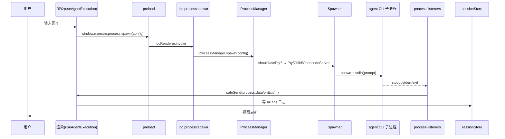
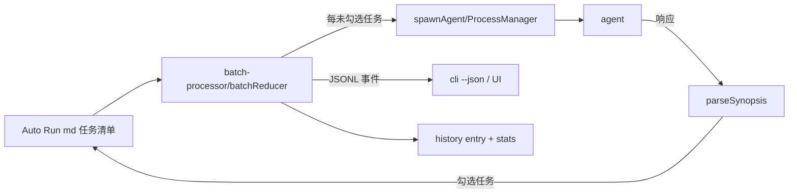
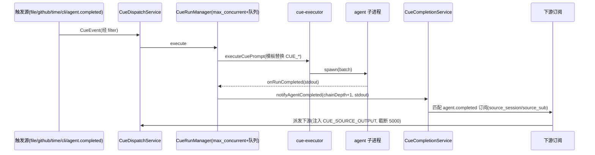
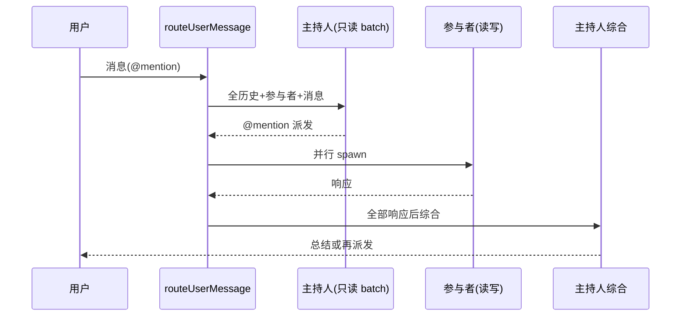

# 核心数据流.md

> 从源码追踪 5 条最关键业务数据流。每步对应真实文件/类型/函数。

## 分析快照

- 分支:`docs/multi-agent-review-loop-analysis`
- HEAD:`9affd8cfb27c8cfe39817ae92879445dc0632b40`
- 工作区状态:任务前 clean;本文档为本次任务新增
- 子模块状态:无
- 分析范围:`src/main/process-manager`、`src/main/process-listeners`、`src/main/cue`、`src/main/group-chat`、`src/cli/services`、`src/renderer/hooks/agent`、`src/renderer/stores`
- 未覆盖范围:未实际运行流(动态时序未验证)

## 证据分类

- Evidence:源码直接证明
- Inference:多证据推导
- Unknown:需运行时确认

## 核心结论

[Evidence] 5 条端到端可追踪的核心流:① 用户 prompt → agent 子进程 → 输出回显;② Auto Run/Playbook 批量;③ Cue 事件链(agent.completed 传播);④ Group Chat 主持人派发;⑤ CLI 远程/无头 spawn。所有流都汇聚到 `ProcessManager.spawn` 与 `process-listeners` → `safeSend` → 渲染 hook → store。
证据:见各流证据索引。

---

## 流 1:用户向 agent 发送 prompt

- 触发:用户回车;输入:`ProcessConfig`(sessionId,toolType,cwd,command,args,prompt,sshRemoteId,sendPromptViaStdin...)。
- 通信边界:IPC `process:*`(渲染↔主)、PTY/stdin(主↔子)。
- 关键类型/函数:`ProcessConfig`(`process-manager/types.ts:22-81`)、`ProcessManager.spawn`(85-175)、`shouldUsePty/shouldUseOpencodeServer`(177-211)、`useAgentListeners`(渲染)。
- 状态变化:`Session.aiTabs` 日志;会话状态 idle→busy→idle。
- 持久化:历史 `history/<sessionId>.json`(stats-listener/exit);session 经 electron-store。
- 事务边界:无;并发边界:同 sessionId 串行(spawn 前 kill 旧)。
- 错误路径:`error-patterns` 匹配 → `agentError` → `AgentErrorBanner`;spawn 失败 → `{success:false}`。
- Evidence:`ProcessManager.ts:85-211`、`process-listeners/index.ts:32-60`、`ipc/handlers/process.ts:124-138`。

## 流 2:Auto Run / Playbook 批量

- 触发:UI 批量按钮 / `maestro-cli playbook`/`run-doc`。
- 输入:文档路径 + prompt 模板(`{{document}}/{{task}}/...`)。
- 关键函数:`runPlaybook`(async generator,`src/cli/services/batch-processor.ts`)、`useBatchProcessor`(渲染 `hooks/batch/`)。
- 持久化:文档勾选回写;history;`registerCliActivity` 通知桌面忙态。
- 并发:每会话串行;`--wait` 等待空闲。
- Evidence:`src/cli/services/batch-processor.ts`、`src/renderer/hooks/batch/useBatchProcessor.ts`、`docs/agent-guides/CLI-PLAYBOOKS.md`。

## 流 3:Cue 事件链(agent.completed 传播)

- 触发:10 种事件;链由 `agent.completed` 驱动。
- 模板变量:`{{CUE_SOURCE_OUTPUT}}` 等(`src/shared/templateVariables.ts:64-104`)。
- 关键约束:`MAX_CHAIN_DEPTH=10`(`cue-engine.ts:79`)、`SOURCE_OUTPUT_MAX_CHARS=5000`(`cue-output-filter.ts:3`)、`source_sub` 防自激。
- 持久化:`cue_events`、`cue_event_queue`(崩溃重放)。
- 错误路径:超时 SIGTERM→SIGKILL;队列陈旧丢弃。
- Evidence:`src/main/cue/cue-dispatch-service.ts`、`cue-run-manager.ts`、`cue-executor.ts:149-247`、`cue-completion-service.ts:122-247`、`CLAUDE-CUE.md`。

## 流 4:Group Chat 主持人派发

- 触发:用户首条消息(`groupChat:sendToModerator`,IPC);**仅交互式,无事件入口**。
- 数据:pipe 分隔 `chat.log`、`history.jsonl`、`metadata.json`。
- 关键函数:`routeUserMessage/routeModeratorResponse/routeAgentResponse/spawnModeratorSynthesis`(`group-chat-router.ts`)。
- 并发:多 @mention 并行;综合轮等待全部响应。
- Evidence:`src/main/group-chat/group-chat-router.ts`、`docs/agent-guides/GROUP-CHAT.md`。

## 流 5:CLI 远程(桌面握手)与无头 spawn

- 远程:`maestro-cli <verb>` → `MaestroClient`(读 `cli-server.json`)→ WebSocket `ws://127.0.0.1:port/token/ws` → 桌面 `messageHandlers` 派发(部分转发渲染 `remote:executeCommand`)。
- 无头:`maestro-cli send/playbook/goal-run/run-doc` → `spawnAgent`(`agent-spawner.ts`)直接 `child_process.spawn` agent CLI,不经桌面。
- maestro-p:Claude 交互模式经 `maestro-p` 包装以用 Max 配额。
- Evidence:`src/cli/services/maestro-client.ts:53-239`、`agent-spawner.ts:1096-1144`、`src/maestro-p/index.ts`、`src/main/web-server/handlers/messageHandlers.ts`。

---

## 数据流质量检查

| 检查项 | 结论 | Evidence |
| --- | --- | --- |
| 重复转换 | agent stdout 经 parser 后多处消费(stats/history/UI/group-chat buffer),为有意多路 | process-listeners |
| 错误丢失 | IPC `createHandler` 统一上报;Cue/插件错误隔离 | ipcHandler.ts |
| 多真相源 | session 真相在 main electron-store,渲染 store 为缓存副本(写穿);窗口状态独立 | stores/instances.ts |
| 越层访问 | 渲染 services 直连 IPC(设计如此) | services/* |
| 事务边界 | 无关系型事务;Cue/Pianola 靠队列与状态机 | cue-run-manager.ts |
| 非幂等 | Auto Run 勾选回写、Cue `task.pending` 内容哈希去抖 | batch-processor.ts、cue-task-scanner.ts |
| 潜在竞态 | 多窗口 safeSend 广播;Cue `max_concurrent`+`activeRootKeys` 防同根重叠 | index.ts:577、CLAUDE-CUE.md |

---

## 已确认事实

- 5 条流均端到端可追踪,汇聚于 ProcessManager + listeners + safeSend + 渲染 hook + store。
- Cue 链有明确深度/截断/自激防护;Group Chat 仅交互式。

## 合理推断

- 多路消费 agent stdout 是有意设计(统计/历史/UI/群聊),非重复实现。

## Unknown 与待验证事项

- 高并发(多 agent 同时输出)下 safeSend 广播与渲染等值选择的实际帧率(需运行)。
- Cue 链在 5000 字截断下长复核意见的实际完整性(见 `docs-analysis/multi-agent-review-workflow.md`)。

## 批判性评估

- 缺统一事务语义在多步流(Auto Run 勾选+Cue 触发)中可能产生中间态,但均有幂等/去抖缓解。

## 建设性改善建议

[Recommendation] 为关键流(尤其 Cue 链与 Auto Run)增加结构化 trace(运行 id 贯穿),便于排查跨流竞态。
优先级:中;实施难度:中;依据:已验证的 chain_root_id/parent_run_id 已部分存在(`cue-engine.ts:onRunCompleted`),可推广到 Auto Run。

## 主要证据索引

- `src/main/process-manager/ProcessManager.ts:85-211`、`types.ts:22-81`
- `src/main/process-listeners/index.ts:32-60`
- `src/main/cue/cue-dispatch-service.ts`、`cue-run-manager.ts`、`cue-executor.ts:149-247`、`cue-completion-service.ts:122-247`
- `src/shared/templateVariables.ts:64-104`、`src/main/cue/cue-output-filter.ts:3`
- `src/main/group-chat/group-chat-router.ts`
- `src/cli/services/batch-processor.ts`、`agent-spawner.ts:1096-1144`、`maestro-client.ts:53-239`
- `src/main/web-server/handlers/messageHandlers.ts`
- `CLAUDE-CUE.md`、`docs/agent-guides/GROUP-CHAT.md`、`CLI-PLAYBOOKS.md`
