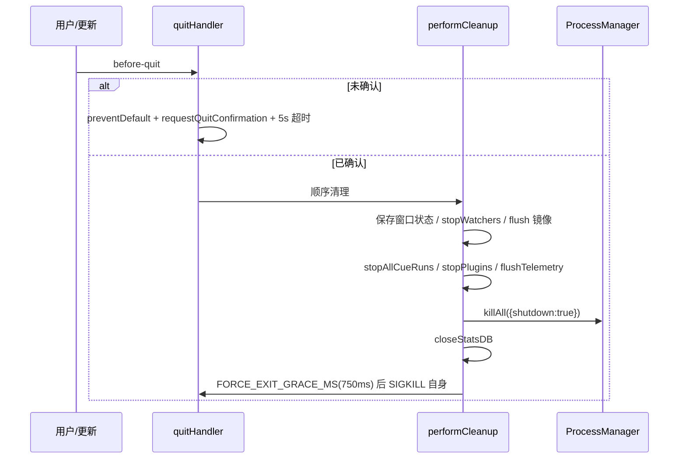

# 运行时架构.md

> 系统运行期间的实际结构:进程、生命周期、IPC、后台任务、关闭与恢复。

## 分析快照

- 分支:`docs/multi-agent-review-loop-analysis`
- HEAD:`9affd8cfb27c8cfe39817ae92879445dc0632b40`
- 工作区状态:任务前 clean;本文档为本次任务新增
- 子模块状态:无
- 分析范围:`src/main/index.ts`、`src/main/app-lifecycle/`、`src/main/process-manager/`、`src/main/process-listeners/`、`src/main/cue/`、`src/main/plugins/`、`src/main/web-server/`、`src/main/power-manager.ts`、`src/main/tunnel-manager.ts`
- 未覆盖范围:实际运行 profiling(未启动应用)

## 证据分类

- Evidence:源码直接证明
- Inference:多证据推导
- Unknown:需动态验证

## 核心结论

[Evidence] 运行时为 **1 个 Electron 主进程 + N 个渲染窗口进程 + N 个外部 agent 子进程 + N 个插件 utilityProcess 沙箱**,可选 1 个内嵌 Fastify WebServer(同进程)。主进程是唯一持久化与编排权威。
证据:`src/main/index.ts:488-503`(单例)、`src/main/plugins/plugin-sandbox-host.ts`(每 tier-1 插件一 utilityProcess)、`src/main/process-manager/ProcessManager.ts`(子进程 Map)、`src/main/web-server/WebServer.ts:157`(同进程 Fastify)。

---

## 1. 进程组成

| 进程         | 技术                                    | 数量             | 职责                                                | Evidence                        |
| ------------ | --------------------------------------- | ---------------- | --------------------------------------------------- | ------------------------------- |
| 主进程       | Electron main / Node                    | 1                | 编排、IPC、存储、spawn、Cue/插件/Pianola、WebServer | `index.ts`                      |
| 渲染进程     | Chromium / React                        | 1~N(多窗口)      | UI、Zustand 状态、IPC 消费                          | `window-registry.ts`、`App.tsx` |
| 预加载       | contextBridge                           | 每窗口 1         | 桥 `window.maestro.*`                               | `preload/index.ts`              |
| agent 子进程 | node-pty / child_process / opencode SDK | N                | 各 AI CLI                                           | `ProcessManager.ts:85-211`      |
| 插件沙箱     | Electron utilityProcess + vm            | 每 tier-1 插件 1 | 隔离执行插件代码                                    | `plugin-sandbox-host.ts`        |
| maestro-p    | 独立 Node CLI                           | 按需             | 包装 Claude TUI 保 Max 配额                         | `src/maestro-p/index.ts`        |

[Inference] 主进程内「逻辑线程」为 Node 单线程 + 异步任务;SQLite 同步、监听器回调、IPC handle 均在同一线程,长任务会阻塞。

## 2. 初始化顺序(启动期 → 运行期)

详见 `SOURCE_ARCHITECTURE.md` 启动时序图。关键边界:

- 编译期:`dist/main/index.js`(tsc)、`dist/preload*.js`(esbuild)、renderer bundle(Vite)。
- 启动期:`whenReady` 链(`index.ts:888-2940`)顺序初始化,失败处多为 try/catch 降级(prompts 失败则 fatal)。
- 运行期:Cue/Pianola/插件 watcher、heartbeat、轮询、scheduler 长驻。
- 关闭期:`quitHandler` 确认 → `performCleanup` 顺序清理 → hard-exit。

## 3. 服务生命周期 / 依赖注入

[Evidence] 长生命周期服务在 `whenReady` 内构造,依赖以闭包/对象注入(如 `CueEngine` 的 `CueEngineDeps`:getSessions/onCueRun/onStopCueRun/onPreventSleep/getUsageStatsEnabled...)。全部 **无条件构造、运行时按 Encore flag 自门控**,故 flag 切换即时生效无需重启。
证据:`src/main/index.ts:1209-1475`(Cue)、`:1496-1534`(Pianola)、`:2201-2435`(插件)、`:2719-2768`(启动门控)。

## 4. 状态生命周期 / DB 连接生命周期

- electron-store:进程级单例,`initializeStores()` 一次构造,退出 `closeStatsDB()` 前不关。
- SQLite:`initializeStatsDB()` 开,`closeStatsDB()`(quit `performCleanup` 末步)关;Cue 库由 `CueRecoveryService.init()` 开。
- 内存状态:ProcessManager `processes` Map、Cue 运行/队列、agent-run ledger store。

## 5. 后台任务 / 调度 / 事件系统

- Cue:`heartbeat`(30s 写 `cue_heartbeat`)、GitHub 轮询(`poll_minutes`)、文件 watcher(chokidar)、任务扫描器(1m)、`app.startup`、`cli.trigger`、`agent.completed`(响应式)。
- 插件:`PluginSchedulerHost`(定时 dispatch,FC3)、`BackgroundSupervisor`(崩溃重启)。
- `UsageRefreshScheduler`、`cliWatcher`、`settingsWatcher`、history 目录监听。
- 事件:ProcessManager extends EventEmitter;插件 `PluginEventBusImpl`;渲染经 IPC `on*` 订阅。

## 6. 文件监听 / 缓存 / 外部进程

- 文件监听:Cue chokidar、插件目录 hot-reload(150ms debounce)、history 目录、playbook 目录。
- 缓存:渲染 `ipcCache`(TTL);主进程 prompt-manager 缓存;history bucket 缓存。
- 外部进程:agent CLI、`gh`、cloudflared(隧道,监督重启)。

## 7. IPC / RPC / 网络通信

- 桌面内:Electron `ipcMain/ipcRenderer`(主↔渲染)。
- 浏览器/CLI:同进程 Fastify WebSocket(`$TOKEN/ws`)与 REST(`$TOKEN/...`)。CLI 发现经 `cli-server.json`(`{port,token,pid,startedAt,version}`)。
- 插件:host↔sandbox 经 RPC(1MB/32 in-flight/200 rps 限流)。
- coworking:独立 Unix domain socket 桥(`coworking-bridge.ts`)。

## 8. 关闭与崩溃恢复

### 正常关闭(时序)

(Evidence:`src/main/app-lifecycle/quit-handler.ts:231-318,347-456,58-86`)

[Inference] SIGKILL-to-self 是为绕过 node-pty/fsevents TSFN 死锁(MAESTRO-3B);耐用状态在宽限窗口内同步 flush。

### 异常 / 崩溃恢复

- 渲染崩溃:`render-process-gone` → `processManager.killAll()` 防 PTY FD 泄漏(`index.ts:817-819`)。
- Cue 队列:`cue_event_queue` 持久化,启动 `restoreAll()` 重放(`cue-engine.ts:596`);agent-run 非终态恢复(`setupAgentRunRecovery`)。
- 插件:`BackgroundSupervisor` 指数退避重启,5 次连续失败 → `failed-permanent`。
- 睡眠唤醒:`powerMonitor.on('resume')` → `cueEngine.reconcileAfterWake()`(`index.ts:2911-2929`)。

## 9. 平台差异 / 故障模式

- 平台:macOS 菜单抑制 Cmd+W/close;Windows shell 偏好(`getWindowsSpawnConfig`);SSH 远程经 wrapper。
- 故障模式:agent CLI 不可用 → AgentDetector 探测失败 → 会话红;node-pty 死锁 → SIGKILL;WebServer 绑定失败 → 重试 3 次。

---

## 已确认事实

- 单主进程 + 多渲染/子进程/沙箱;主进程为唯一权威。
- 服务无条件构造 + Encore 自门控,即时生效。
- 关闭带确认 + 顺序清理 + SIGKILL;崩溃有恢复路径。

## 合理推断

- 主进程单线程,SQLite 同步与密集监听器回调是潜在阻塞点。

## Unknown 与待验证事项

- 多窗口同时活跃时 Cue/Group Chat 的窗口归属与广播正确性(需运行)。
- 长时间运行下 SQLite WAL 与 history 文件的累积行为(未压力测试)。

## 批判性评估

- SIGKILL 退出是稳健性妥协,已文档化,属可接受技术债。
- 服务「无条件构造 + 自门控」对启动开销有影响(即便未启用也构造),换取运行时开关灵活性。

## 建设性改善建议

[Recommendation] 为主进程关键异步路径(如 Cue dispatch、插件 RPC)增加可观测的耗时指标,识别单线程阻塞。
优先级:低;实施难度:中;依据:已验证的单线程 + 同步 SQLite 模型。

## 主要证据索引

- `src/main/index.ts:488-503,817-819,888-2940,2719-2768,2911-2929`
- `src/main/app-lifecycle/quit-handler.ts:58-86,231-318,347-456`
- `src/main/process-manager/ProcessManager.ts:45-211`
- `src/main/cue/cue-engine.ts:159-542,596`
- `src/main/plugins/plugin-sandbox-host.ts`、`plugin-background-supervisor.ts`
- `src/main/web-server/WebServer.ts:157`
- `src/main/tunnel-manager.ts`、`src/main/power-manager.ts`
